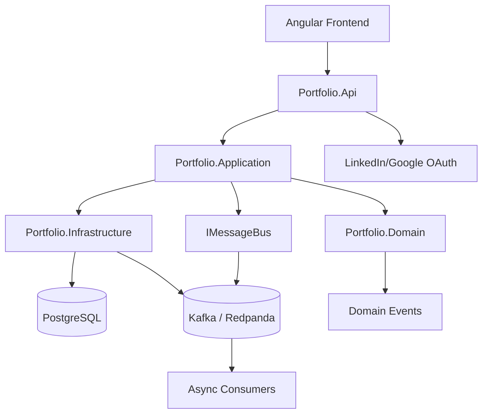

# 🧩 Portfolio CMS Backend — ENHANCED INSTRUCTIONS (Production-Ready)

**Location:** `D:\portfolio.api`  
**Stack:** .NET 10  (Minimal API), C#, EF Core (Postgres), Kafka (or Azure Service Bus), Angular frontend, Docker/Kubernetes (AKS), Azure DevOps CI/CD, .NET Aspire for local orchestration.

This is the **final enhanced scaffold instruction** for GitHub Copilot / Claude to generate the backend + frontend scaffolding, tests, CI/CD, and documentation. Includes: architecture, code flow, technology rationale, TDD, Git workflow, error handling, security, migrations, and frontend integration examples.

---

## Table of Contents
1. Overview & Goals  
2. Folder Layout  
3. Domain Model (Tenant, User, Blog, Portfolio)  
4. Clean Architecture & CQRS (custom)  
5. Request Lifecycle — Detailed Walkthrough  
6. Technologies & Rationale  
7. Git Workflow & Branching  
8. TDD, Mocks & Test Strategy  
9. Event-Driven Details (Kafka)  
10. Multi-Tenant & Auth Integration  
11. Blog Module & Portfolio Generation  
12. Frontend Integration Example (Angular)  
13. DevOps: Docker, Aspire, AKS, Azure DevOps  
14. Error Handling, Logging & Observability  
15. Security Practices  
16. Database Migrations  
17. Swagger / OpenAPI / Postman  
18. Quickstart & API Examples  
19. Mermaid Diagram (Visual Architecture)  
20. Notes & Recommendations

---

## 1. Overview & Goals
Build a production-minded Portfolio CMS backend at `D:\portfolio.api` with:
- Clean Architecture & custom CQRS (commands/queries, no MediatR)
- Event-driven flows via Kafka / Azure Bus
- Multi-tenancy & JWT/OAuth2 authentication (LinkedIn, Google, Email/Password)
- TDD-first with xUnit, Moq, FluentAssertions
- Container-native: Docker + Helm, deployable to AKS
- Angular frontend consumption
- Mock mode for testing and local dev

---

## 2. Folder Layout
```
D:\portfolio.api
├─ src/
│  ├─ Portfolio.Api/
│  ├─ Portfolio.Application/
│  ├─ Portfolio.Domain/
│  └─ Portfolio.Infrastructure/
├─ tests/
│  └─ Portfolio.Application.Tests/
├─ deploy/
│  ├─ docker-compose.yml
│  └─ helm/
├─ docs/
│  ├─ Quickstart.md
│  └─ API.md
├─ .gitignore
└─ azure-pipelines.yml
```

---

## 3. Domain Model (Canonical Definitions)

**Tenant, User, Blog, Portfolio** schemas remain as previously defined.  
Add **Domain Events** (`TenantCreatedEvent`, `BlogCreatedEvent`, `PortfolioGeneratedEvent`) in Domain layer.

---

## 4. Clean Architecture & CQRS (custom)

- Application layer: interfaces (`IRepository`, `IMessageBus`, `IAuthService`), DTOs, Commands/Queries/Handlers.  
- Domain: entities, value objects, events.  
- Infrastructure: EF Core, Kafka/Azure Bus, Auth adapters.  
- Api: Composition root (DI, middleware, endpoints).  

Dependency rules enforced: Domain <- Application <- Infrastructure <- API.

---

## 5. Request Lifecycle — Detailed Walkthrough

- Authentication via JWT/OAuth2 → TenantContext → Command → Handler → Repository → Domain Event → MessageBus → API Response.  
- Outbox pattern recommended for atomic persistence + Kafka publish.  
- Lifecycle includes async consumers for indexing or notifications.

---

## 6. Technologies & Rationale

- .NET 10 Minimal API: concise, fast startup, container-friendly  
- Angular frontend: strong market demand, SSR/SPA  
- Kafka: high throughput, replayable events  
- EF Core + PostgreSQL: reliable persistence with migrations  
- .NET Aspire: local orchestration  
- Docker + Helm + AKS: local & cloud parity  
- TDD / Mocks: ensures regression safety, modular design

---

## 7. Git Workflow & Branching

- main: deployable, protected  
- develop: integration branch  
- feature/{name}, hotfix/{name}, release/{version}  
- Conventional commits: feat(), fix(), chore(), test()  
- CI gate: build + tests + static analysis

---

## 8. TDD, Mocks & Test Strategy

- Unit tests: xUnit + Moq for handlers  
- Integration: TestServer / WebApplicationFactory, Testcontainers  
- End-to-end: Newman with Postman collection  
- Mock mode: InMemoryRepo + InMemoryBus, toggle with `USE_MOCKS=true`  
- CI code coverage enforcement (≥80%)

---

## 9. Event-Driven Details (Kafka)

- Topics: `tenants.created`, `blogs.created`, `portfolio.generated`  
- Schema: JSON / Avro + versioning (v1, v2)  
- Consumers: idempotent, log offsets  
- Outbox pattern for atomicity

---

## 10. Multi-Tenant & Auth Integration

- TenantContext from `X-Tenant-Id` header or JWT claim  
- JWT token claims include `tenantId`  
- Row-Level Security (optional) for stronger DB isolation  
- OAuth2 mapping for LinkedIn/Google users

---

## 11. Blog Module & Portfolio Generation

- Blog: WYSIWYG content, HeaderImageUrl, Published flag  
- Portfolio: import LinkedIn or resume, AI-assisted template  
- FeaturedBlogsEnabled toggles blog links  
- Manual CMS refinement endpoint included

---

## 12. Frontend Integration Example (Angular)

- Angular service example for blog creation:
```typescript
@Injectable()
export class BlogService {
  constructor(private http: HttpClient) {}
  createBlog(blog: BlogDto, tenantId: string, token: string) {
    const headers = new HttpHeaders({ Authorization: `Bearer ${token}`, 'X-Tenant-Id': tenantId });
    return this.http.post('/api/blogs', blog, { headers });
  }
}
```
- Angular consumes API, handles JWT, tenant selection, and blog display.

---

## 13. DevOps: Docker, Aspire, AKS, Azure DevOps

- Multi-stage Dockerfile  
- docker-compose for local services (Postgres + Redpanda)  
- Helm chart with values.yaml templates  
- Azure DevOps pipeline: restore → build → tests → docker push → helm deploy

---

## 14. Error Handling, Logging & Observability

- ExceptionMiddleware: returns structured response (`code`, `message`, `details`)  
- Serilog for structured logging + sink (console, file, or seq)  
- Metrics: optional Prometheus / Grafana  
- Middleware order: Logging → Auth → Tenant → Error handling → Endpoints

---

## 15. Security Practices

- JWT expiry + optional refresh tokens  
- Rate limiting middleware  
- WYSIWYG HTML sanitization  
- Secrets: use Azure Key Vault or local .env with masking in CI/CD logs

---

## 16. Database Migrations

- Create migration: `dotnet ef migrations add InitialCreate -p Portfolio.Infrastructure -s Portfolio.Api`  
- Apply migration: `dotnet ef database update -p Portfolio.Infrastructure -s Portfolio.Api`  
- Rollback migration: `dotnet ef database update <previous_migration>`

---

## 17. Swagger / OpenAPI / Postman

- Enable Swagger UI: `/swagger/index.html`  
- Export OpenAPI: `dotnet swagger tofile --output docs/API.md`  
- Generate Postman collection: `newman export ...` (include in `/tests/postman/`)

---

## 18. Quickstart & API Examples

- Docker up local stack: `docker compose -f deploy/docker-compose.yml up -d`  
- Run API: `dotnet run --project src/Portfolio.Api`  
- Example: create blog, import LinkedIn/resume, fetch portfolio

---

## 19. Mermaid Diagram (Visual Architecture)



---

## 20. Notes & Recommendations

- Ensure Outbox pattern for critical events  
- Enforce TDD and code coverage in CI  
- Use mock mode during local development  
- Extend portfolio AI + CMS incrementally  
- Keep secrets out of repo, rotate periodically

---

**End of Enhanced Instructions**  
Ready for GitHub Copilot / Claude scaffolding of the full backend + frontend stack.
Test Using Playwright. Playwright MCP is hosted at port 9000
